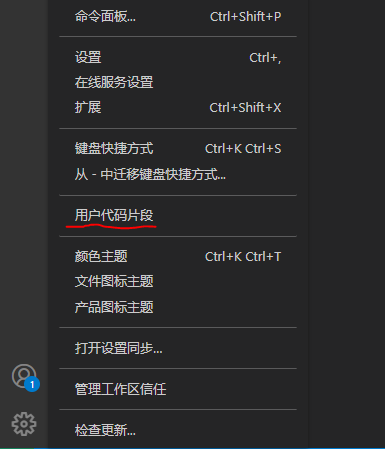
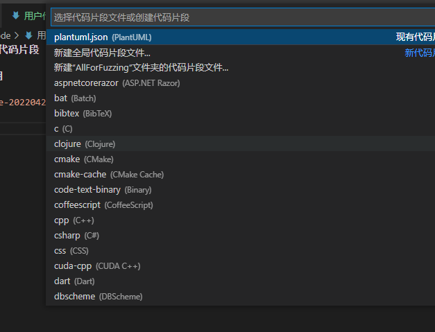
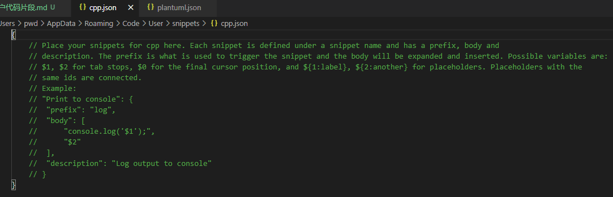
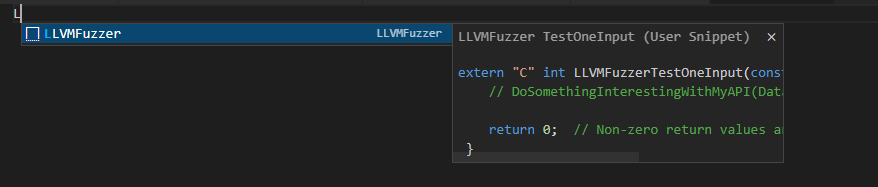

# 用户代码片段/User Snippets

## 使用

1. setting -> 用户代码片段/User Snippets



2. 选择语言
   



3. 编辑，语法参考 [userdefinedsnippets](https://code.visualstudio.com/docs/editor/userdefinedsnippets)




## 样例

### cpp


```json
{
	// Place your snippets for cpp here. Each snippet is defined under a snippet name and has a prefix, body and 
	// description. The prefix is what is used to trigger the snippet and the body will be expanded and inserted. Possible variables are:
	// $1, $2 for tab stops, $0 for the final cursor position, and ${1:label}, ${2:another} for placeholders. Placeholders with the 
	// same ids are connected.
	// Example:
	"LLVMFuzzer": {
		"prefix": "LLVMFuzzer",
		"body": [
			"extern \"C\" int LLVMFuzzerTestOneInput(const uint8_t *Data, size_t Size) {",
			"    // DoSomethingInterestingWithMyAPI(Data, Size);",
			"    $1",
			"    return 0;  // Non-zero return values are reserved for future use.",
			" }"
		],
		"description": "LLVMFuzzer TestOneInput"
	}
}
```

